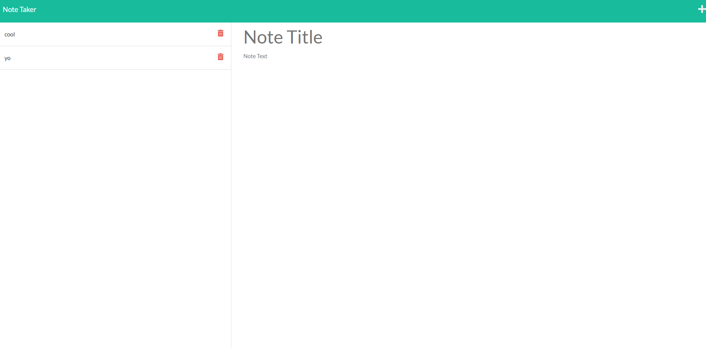

<!-- PROJECT LOGO -->
<br />
<p align="center">
  <h3 align="center">Note Taker Using Express.js</h3>

  <p align="center">
    Allowes you to save notes as well as delete them
    <br />
    <a href="https://github.com/BaileyB227/NoteTaker"><strong>Explore the docs »</strong></a>
    <br />
    <br />
    <a href="https://github.com/BaileyB227/NoteTaker">View Demo</a>
    ·
    <a href="https://github.com/BaileyB227/NoteTaker/issues">Report Bug</a>
    ·
    <a href="https://github.com/BaileyB227/NoteTaker/issues">Request Feature</a>
  </p>
</p>


<!-- TABLE OF CONTENTS -->
<details open="open">
  <summary><h2 style="display: inline-block">Table of Contents</h2></summary>
  <ol>
    <li>
      <a href="#about-the-project">About The Project</a>
      <ul>
        <li><a href="#built-with">Built With</a></li>
      </ul>
    </li>
    <li>
      <a href="#getting-started">Getting Started</a>
      <ul>
        <li><a href="#prerequisites">Prerequisites</a></li>
        <li><a href="#installation">Installation</a></li>
      </ul>
    </li>
    <li><a href="#license">License</a></li>
    <li><a href="#contact">Contact</a></li>
  </ol>
</details>


<!-- ABOUT THE PROJECT -->
## About The Project




## App deployed on Heroku:
https://desolate-fortress-02592.herokuapp.com/


### Built With

* Express
* Javascript
* HTML
* CSS


<!-- GETTING STARTED -->
## Getting Started

To get a local copy up and running follow these simple steps.

### Prerequisites

This is an example of how to list things you need to use the software and how to install them.
* npm
  ```sh
  npm install npm@latest -g
  ```

### Installation

1. Clone the repo
   ```sh
   git clone https://github.com/BaileyB227/NoteTaker.git
   ```
2. Install NPM packages
   ```sh
   npm install
   ```


## License

MIT License


<!-- CONTACT -->
## Contact

Bailey Bennett - BaileyB227@gmail.com

Project Link: [https://github.com/BaileyB227/NoteTaker](https://github.com/BaileyB227/NoteTaker)